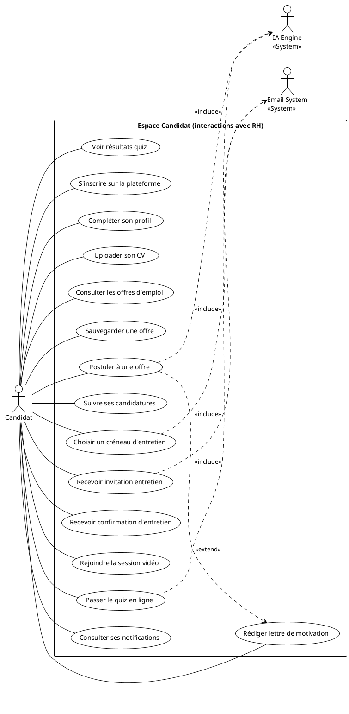

# 📊 Diagramme Use Case — Module RH (HumatiQ)

Analyse complète basée sur le code source : routers, models, frontend apps/HR.

---

## Acteurs identifiés

| Acteur | Rôle |
|---|---|
| **Admin / ARH** | Administrateur RH principal — accès total |
| **Recruteur** | Gestion des offres, candidatures, entretiens |
| **Chef de département** | Validation et consultation dans son périmètre |
| **IA Engine** | Système d'intelligence artificielle interne |
| **Candidat** | Utilisateur externe postulant aux offres |
| **Google Calendar** | Système externe de calendrier |
| **Email System** | Système d'envoi de mails (SMTP) |

---

## Diagramme Use Case Global — Partie HR

```plantuml
@startuml HumatiQ_RH_UseCase_Complet
skinparam backgroundColor #F8FAFC
skinparam defaultFontName Arial
skinparam actor {
  BackgroundColor #2D3748
  FontColor white
  BorderColor #6C63FF
}
skinparam usecase {
  BackgroundColor #EBF8FF
  BorderColor #3182CE
  FontColor #2D3748
}
skinparam rectangle {
  BackgroundColor #F7FAFC
  BorderColor #CBD5E0
}

left to right direction

' ── ACTEURS ──────────────────────────────────────
actor "Admin / ARH" as ARH
actor "Recruteur" as REC
actor "Chef Département" as CHEF
actor "Candidat" as CAND
actor "IA Engine\n<<System>>" as AI
actor "Google Calendar\n<<System>>" as GCal
actor "Email System\n<<System>>" as EMAIL

' ── HÉRITAGE D'ACTEURS ───────────────────────────
ARH --|> REC
CHEF --|> REC

' ══════════════════════════════════════════════════
' MODULE 1 : AUTHENTIFICATION & PROFIL
' ══════════════════════════════════════════════════
rectangle "1. Authentification & Profil HR" {
    usecase "Se connecter (Email/Password)" as UC1_1
    usecase "Se connecter (Google/LinkedIn)" as UC1_2
    usecase "Se déconnecter" as UC1_3
    usecase "Réinitialiser mot de passe" as UC1_4
    usecase "Vérifier email (OTP)" as UC1_5
    usecase "Configurer profil RH" as UC1_6
    usecase "Gérer préférences" as UC1_7
    usecase "Connecter Google Calendar" as UC1_8
}

ARH -- UC1_1
ARH -- UC1_2
ARH -- UC1_3
ARH -- UC1_4
ARH -- UC1_5
ARH -- UC1_6
ARH -- UC1_7
ARH -- UC1_8
UC1_8 ..> GCal : <<include>>

' ══════════════════════════════════════════════════
' MODULE 2 : GESTION DES OFFRES D'EMPLOI
' ══════════════════════════════════════════════════
rectangle "2. Gestion des Offres d'Emploi" {
    usecase "Créer une offre d'emploi" as UC2_1
    usecase "Modifier une offre d'emploi" as UC2_2
    usecase "Supprimer une offre d'emploi" as UC2_3
    usecase "Consulter toutes les offres" as UC2_4
    usecase "Filtrer les offres par département" as UC2_5
    usecase "Voir les stats de l'offre\n(candidats, score moyen)" as UC2_6
    usecase "Gérer les départements" as UC2_7
}

ARH -- UC2_1
ARH -- UC2_2
ARH -- UC2_3
ARH -- UC2_4
ARH -- UC2_5
ARH -- UC2_6
ARH -- UC2_7
UC2_5 ..|> UC2_4 : <<extend>>
UC2_6 ..|> UC2_4 : <<extend>>

' ══════════════════════════════════════════════════
' MODULE 3 : PIPELINE DE CANDIDATURES
' ══════════════════════════════════════════════════
rectangle "3. Pipeline de Candidatures (Kanban)" {
    usecase "Voir les candidatures d'un poste" as UC3_1
    usecase "Changer le statut d'une candidature" as UC3_2
    usecase "Consulter profil 360° du candidat" as UC3_3
    usecase "Télécharger le CV" as UC3_4
    usecase "Voir snapshot de candidature" as UC3_5
    usecase "Supprimer une candidature" as UC3_6
    usecase "Voir score IA de pertinence" as UC3_7
    usecase "Voir justification IA" as UC3_8
    usecase "Filtrer candidatures par statut" as UC3_9
    usecase "Réinitialiser une candidature" as UC3_10
}

ARH -- UC3_1
ARH -- UC3_2
ARH -- UC3_3
ARH -- UC3_4
ARH -- UC3_5
ARH -- UC3_6
ARH -- UC3_7
ARH -- UC3_8
ARH -- UC3_9
ARH -- UC3_10
UC3_7 ..|> UC3_3 : <<include>>
UC3_8 ..|> UC3_7 : <<extend>>

' ══════════════════════════════════════════════════
' MODULE 4 : ÉVALUATION & NOTATION HR
' ══════════════════════════════════════════════════
rectangle "4. Évaluation & Notation HR" {
    usecase "Attribuer une note (1-5★) au candidat" as UC4_1
    usecase "Modifier sa notation précédente" as UC4_2
    usecase "Voir la note moyenne (multi-RH)" as UC4_3
    usecase "Vérifier qualification (Expérience)" as UC4_4
    usecase "Vérifier qualification (Formation)" as UC4_5
    usecase "Vérifier qualification (Certificat)" as UC4_6
    usecase "Télécharger preuve de qualification" as UC4_7
    usecase "Ajouter note de vérification" as UC4_8
}

ARH -- UC4_1
ARH -- UC4_2
ARH -- UC4_3
ARH -- UC4_4
ARH -- UC4_5
ARH -- UC4_6
ARH -- UC4_7
ARH -- UC4_8
UC4_2 ..|> UC4_1 : <<extend>>
UC4_4 ..> UC4_7 : <<extend>>
UC4_5 ..> UC4_7 : <<extend>>
UC4_6 ..> UC4_7 : <<extend>>

' ══════════════════════════════════════════════════
' MODULE 5 : GÉNÉRATION & GESTION DE QUIZ
' ══════════════════════════════════════════════════
rectangle "5. Génération & Gestion de Quiz IA" {
    usecase "Uploader un document de référence" as UC5_1
    usecase "Générer quiz mono-document" as UC5_2
    usecase "Générer quiz multi-documents" as UC5_3
    usecase "Prévisualiser les questions" as UC5_4
    usecase "Modifier les questions du quiz" as UC5_5
    usecase "Ajouter une question à la volée" as UC5_6
    usecase "Publier le quiz au candidat" as UC5_7
    usecase "Archiver un quiz" as UC5_8
    usecase "Vérifier existence quiz (par candidature)" as UC5_9
    usecase "Consulter les résultats du quiz" as UC5_10
    usecase "Voir analyse IA du quiz" as UC5_11
}

ARH -- UC5_1
ARH -- UC5_2
ARH -- UC5_3
ARH -- UC5_4
ARH -- UC5_5
ARH -- UC5_6
ARH -- UC5_7
ARH -- UC5_8
ARH -- UC5_9
ARH -- UC5_10
ARH -- UC5_11
UC5_2 ..> AI : <<include>>
UC5_3 ..> AI : <<include>>
UC5_5 ..|> UC5_4 : <<extend>>
UC5_7 ..> EMAIL : <<include>>

' ══════════════════════════════════════════════════
' MODULE 6 : PLANIFICATION D'ENTRETIENS
' ══════════════════════════════════════════════════
rectangle "6. Planification & Conduite d'Entretiens" {
    usecase "Proposer des créneaux d'entretien" as UC6_1
    usecase "Créer entretien directement" as UC6_2
    usecase "Modifier un entretien" as UC6_3
    usecase "Annuler un entretien" as UC6_4
    usecase "Voir les entretiens de la société" as UC6_5
    usecase "Voir créneaux occupés (anti-doublon)" as UC6_6
    usecase "Synchroniser avec Google Calendar" as UC6_7
    usecase "Démarrer la session vidéo (WebRTC)" as UC6_8
    usecase "Terminer l'entretien" as UC6_9
    usecase "Voir transcription temps réel" as UC6_10
    usecase "Analyser émotions en temps réel" as UC6_11
    usecase "Générer analyse IA post-entretien" as UC6_12
    usecase "Voir rapport IA de l'entretien" as UC6_13
    usecase "Voir historique des entretiens" as UC6_14
}

ARH -- UC6_1
ARH -- UC6_2
ARH -- UC6_3
ARH -- UC6_4
ARH -- UC6_5
ARH -- UC6_6
ARH -- UC6_7
ARH -- UC6_8
ARH -- UC6_9
ARH -- UC6_10
ARH -- UC6_11
ARH -- UC6_12
ARH -- UC6_13
ARH -- UC6_14

UC6_1 ..> EMAIL : <<include>>
UC6_7 ..> GCal : <<include>>
UC6_11 ..> AI : <<include>>
UC6_12 ..> AI : <<include>>
UC6_6 ..|> UC6_1 : <<include>>

' ══════════════════════════════════════════════════
' MODULE 7 : NOTIFICATIONS & ALERTES
' ══════════════════════════════════════════════════
rectangle "7. Notifications & Alertes" {
    usecase "Recevoir alerte nouvelle candidature" as UC7_1
    usecase "Recevoir rapport de performance" as UC7_2
    usecase "Recevoir confirmation de créneau" as UC7_3
    usecase "Recevoir rappel entretien (24h/1h)" as UC7_4
    usecase "Consulter centre de notifications" as UC7_5
    usecase "Marquer notifications comme lues" as UC7_6
}

ARH -- UC7_1
ARH -- UC7_2
ARH -- UC7_3
ARH -- UC7_4
ARH -- UC7_5
ARH -- UC7_6
UC7_1 ..> EMAIL : <<extend>>
UC7_4 ..> EMAIL : <<include>>

' ══════════════════════════════════════════════════
' MODULE 8 : ANALYTICS & TABLEAU DE BORD
' ══════════════════════════════════════════════════
rectangle "8. Analytics & Tableau de Bord RH" {
    usecase "Voir KPIs société (jobs, candidats, entretiens)" as UC8_1
    usecase "Voir distribution par département" as UC8_2
    usecase "Voir tendance des candidatures (30j)" as UC8_3
    usecase "Voir score IA moyen des candidats" as UC8_4
    usecase "Voir top profils (score ≥ 90)" as UC8_5
}

ARH -- UC8_1
ARH -- UC8_2
ARH -- UC8_3
ARH -- UC8_4
ARH -- UC8_5

@enduml
```

---

## Diagramme Use Case — Vue Candidat (interactions avec le système HR)

---

## Tableau récapitulatif des Use Cases HR

| # | Module | Use Case | Acteur principal | Priorité |
|---|--------|----------|-----------------|----------|
| 1.1 | Auth | Se connecter | ARH / REC / CHEF | 🔴 Essentiel |
| 1.8 | Auth | Connecter Google Calendar | ARH | 🟡 Important |
| 2.1 | Offres | Créer une offre d'emploi | ARH | 🔴 Essentiel |
| 2.6 | Offres | Voir stats de l'offre | ARH | 🟡 Important |
| 3.1 | Pipeline | Voir candidatures (Kanban) | ARH / REC | 🔴 Essentiel |
| 3.3 | Pipeline | Profil 360° du candidat | ARH / REC | 🔴 Essentiel |
| 3.7 | Pipeline | Score IA de pertinence | ARH / REC | 🔴 Essentiel |
| 4.1 | Éval | Notation candidat (★) | ARH / REC / CHEF | 🟡 Important |
| 4.4 | Éval | Vérification qualifications | ARH / REC | 🟡 Important |
| 5.1 | Quiz | Upload document référence | ARH | 🔴 Essentiel |
| 5.2 | Quiz | Générer quiz IA | ARH | 🔴 Essentiel |
| 5.7 | Quiz | Publier quiz au candidat | ARH | 🔴 Essentiel |
| 6.1 | Entretien | Proposer créneaux | ARH / REC | 🔴 Essentiel |
| 6.8 | Entretien | Session vidéo WebRTC | ARH / REC | 🔴 Essentiel |
| 6.11 | Entretien | Analyse émotions IA | AI | 🟠 Avancé |
| 6.12 | Entretien | Rapport IA post-entretien | AI | 🟠 Avancé |
| 7.x | Notifs | Alertes & notifications | ARH / REC | 🟡 Important |
| 8.x | Analytics | KPIs & tableaux de bord | ARH | 🟡 Important |
