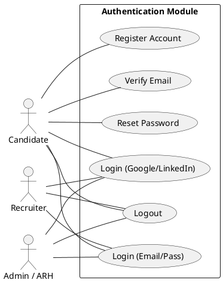
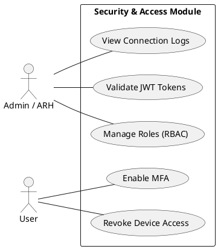
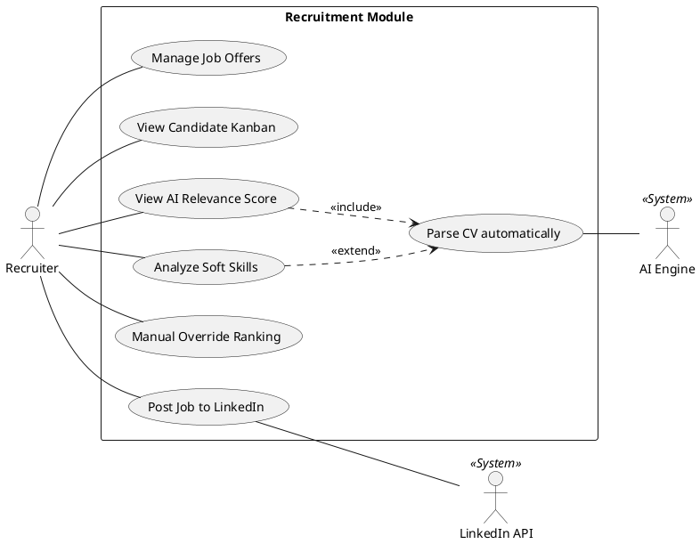
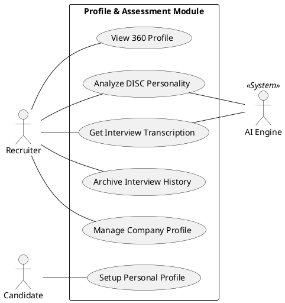
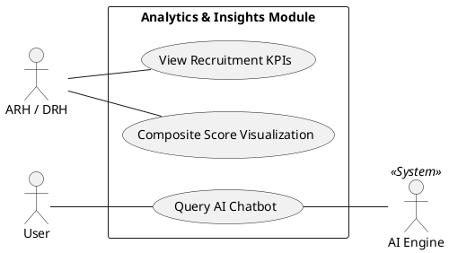
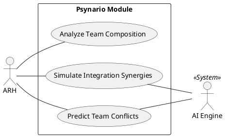
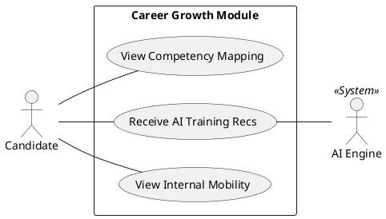
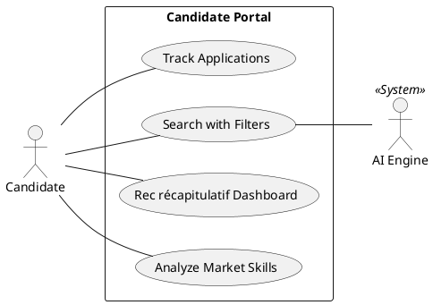
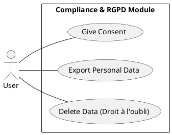
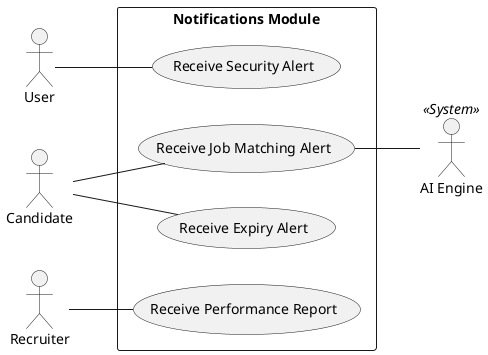

# HumatiQ Modular Use Case Diagrams

This document contains detailed Use Case Diagrams for each module of the HumatiQ platform.

## 1. Authentication & Identity
Focuses on user access, registration, and security verification.

---

## 2. Security & Access Control (RBAC)
Focuses on system security, role management, and audit trails.

---

## 3. Recruitment Management (RECRUIT)
The core recruitment engine including AI-powered parsing and scoring.

---

## 4. Profile & Assessment (PROFILE)
Candidate profiles, interviews, and personality assessments.

---

## 5. Analytics & Insights (INSIGHT)
Data visualization and intelligent dashboarding.

---

## 6. Psychological Synergy (PSYNARIO)
Team dynamics and integration simulations.

---

## 7. Career Growth (GROW)
Focus on candidate development and internal mobility.

---

## 8. Candidate Portal
Direct interface for candidate interactions.

---

## 9. Compliance & Privacy (RGPD)
Data protection and user rights.

---

## 10. Automated Notifications
Communication and alerting system.

